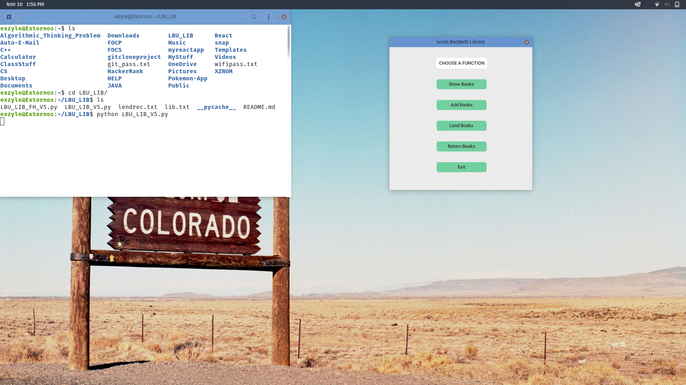
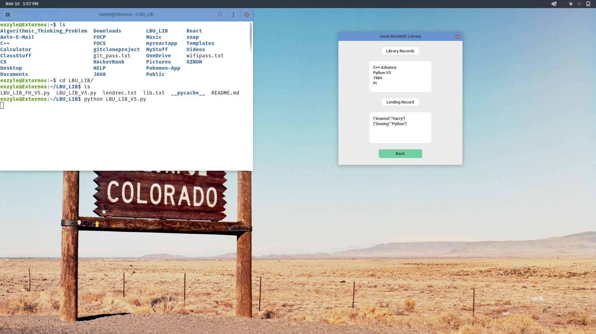
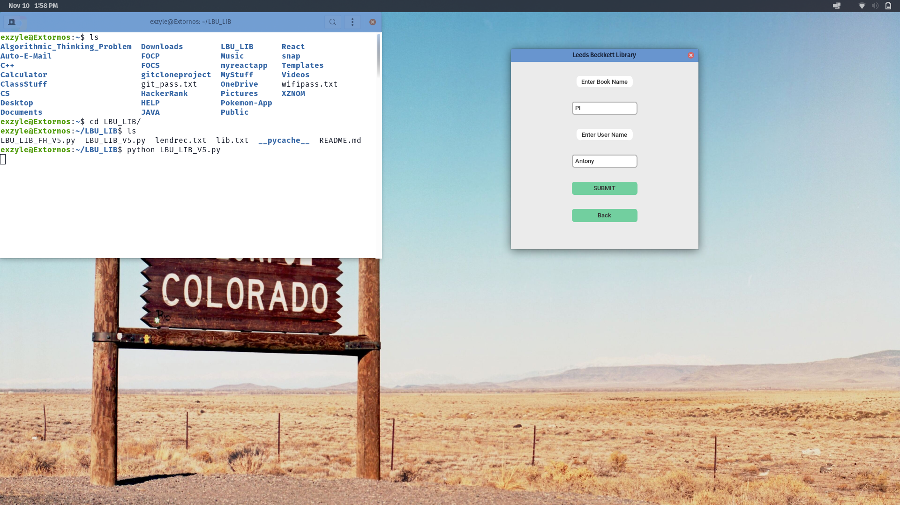

[PyPI](https://pypi.org/project/caliz/)

# LBU_LIB MANAGEMENT SYSTEM


| _`LBU_LIB_V5.py` Demo View First_


| _`LBU_LIB_V5.py` Demo View Second_


| _`LBU_LIB_V5.py` Demo View Third_

A professional visual look has been implemented to this library management system with the use of the custom tkinter library. The system is built on the concept of Object Oriented Programming which is completely done in
python. The UI is intuitive and is easy to grasp. As such the program is very user friendly. You can use the system appearance or the manually set mode ('light', 'dark'), whichever you prefer, and you'll get a consistent appearance, Windows, macOS, and Linux all have a fresh, modern look.


## Installation
Install the module with pip:
Required Packages
1. customtkinter
2. tkinter

For installing required packages
```
pip3 install customtkinter
pip3 install tkinter or pip3 install tk
pip3 install lbulib
```
**Update existing installation:** ```pip3 install lbulib --upgrade```\
(update as often as possible because this library is under active development)

## Use-HowTO

After installing **LBULIB** go to python in terminal and import lib from lbulib library, 
i.e. --> **from lbulib import lib**
and the lib will be shown to you.

If you need to get more info about CustomTkinter Go through the **Documentation** provided below,

## Documentation

The **official** documentation for CustomTkinter can be found in the Wiki Tab here:

**--> [Documentation](https://github.com/TomSchimansky/CustomTkinter/wiki)**.

Thank You From LBU-GRADERS.
